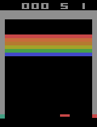

Deep Q Learning
===

Implementation of deep Q learning as described in the berkeley reinforcement learning course
[lectures](https://www.youtube.com/watch?v=nZXC5OdDfs4&index=7&list=PLkFD6_40KJIznC9CDbVTjAF2oyt8_VAe3)

Trained on an i5 & gtx 1080 with 16 GB of RAM.

Training for 100 million frames took ~ 8 days.

Takeaways
---

#### Gym environments can't render inside jupyter notebooks

Actually, it can be done with some fiddling, but raw python looked like it would be easier over ssh

#### Training on RAM is harder than training on pixels

I started by trying to train on the Breakout-ram environment. I supposed that this would be easier because ram is a much
lower dimensional imbedding than the raw pixels.  Unfortunately, this turned out to be
[more difficult](https://openai.com/requests-for-research/#q-learning-on-the-ram-variant-of-atari) than I had originally
realized and I switched back to training in the pixel environment.  I haven't gone back to try out RAM now that I got
pixels working, but it looks like a solved problem anyway.

#### Staple together your training observations

This is mentioned in the deepmind paper, but I missed this on my first implementation attempt.
Your agent needs to know the direction that the ball is moving at each observation in order to make a sensible assesment
about which action will yield the most reward.  Since each observation from the environment is only one frame of pixels,
you'll need to feed your agent an array of images(a video) representing the last four frames that it has observed.

#### Watch out for your memory growth

The replay buffer, which is stored in RAM, requires a ridiculous amount of memory.  Downsample and grayscale your image
frames and ensure that you aren't duplicating frame data across observations in your replay buffer.  If observation #1
has frames 1-4 and observation #2 has frames 2-5, make sure you're referencing the same object for frames 2, 3, and 4.
If you store an entire observation as a numpy array instead of a list of numpy arrays, the frames will be duplicated.

#### Try ending the episode after dying

I trained the agent for 50 million frames with five lives and couldn't get its score above ~35.  I started ending the
episode after one death and that made a huge difference.

#### Don't be afraid to increase the size of your neural network.

I tried training with a smaller network at first as used in the
[original deepmind atari paper](https://arxiv.org/abs/1312.5602), but I wasn't getting any results until I switched to
the larger network that was used in [human level control](https://deepmind.com/research/publications/human-level-control-through-deep-reinforcement-learning/)

Results
---

Unfortunately, I failed to graph the 100 episode reward over time, but I did manage to save the agent at 50 million and
100 million frames.

  

*The agent after 50 million frames of training.  Note that the agent was hardcoded to press the "next life"
button during test time.  Since we always ended the episode after one life, it never learned to take that action.*

  

*The agent after 100 million frames of training.  The agent didn't actually improve after the first ~75 million frames.
Since we only trained with one life, the agent doesn't seem to know what to do after it dies.*
